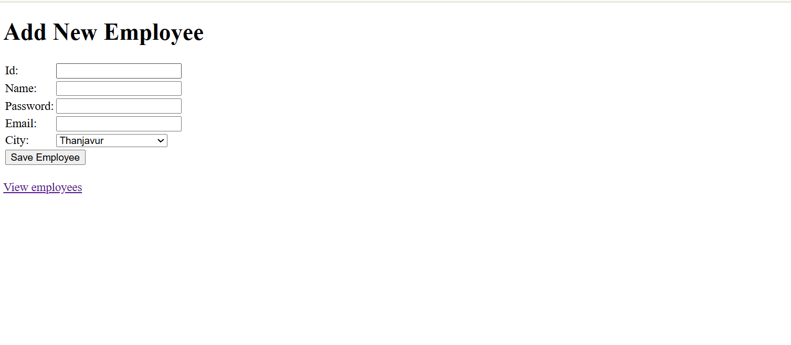
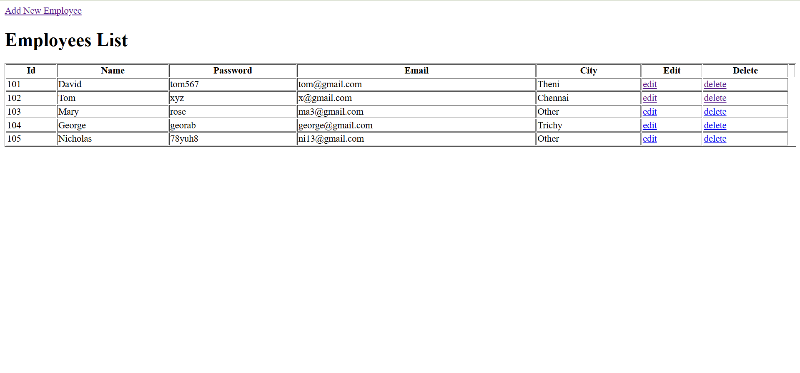

# Employee Management System – CRUD (Java Servlet + MySQL)

A simple and professional **CRUD web application** built using **Java Servlets**, **MySQL**, and **Tomcat**.  
This project demonstrates how to Create, Read, Update, and Delete employee records using the MVC architecture.
---

## 📌 Features
- **Add New Employee** – ID, Name, Password, Email, and City.
- **View Employees** – List all employees with details.
- **Edit Employee** – Update existing employee information.
- **Delete Employee** – Remove employees from the database.
- **Form Validation** (basic HTML form checks).

---

## 🛠️ Tech Stack
- **Java Servlets & JSP** – For dynamic web content
- **JDBC** – For MySQL database connection
- **MySQL** – Database for storing employee details
- **Apache Tomcat** – Servlet container for deployment
- **HTML & CSS** – Frontend structure and styling

---

## 📂 Project Structure
src/
├── model/
│ └── Emp.java # Employee model class
├── dao/
│ └── EmpDao.java # Database operations
├── servlet/
│ ├── SaveServlet1.java # Create operation
│ ├── ViewServlet1.java # Read operation
│ ├── EditServlet.java # Load edit form
│ ├── EditServlet2.java # Update operation
│ └── DeleteServlet.java # Delete operation
webapp/
├── index.html # Add employee form
├── WEB-INF/web.xml # Servlet mappings
lib/
├── mysql-connector-java.jar # MySQL JDBC driver
└── servlet-api.jar # Servlet API library

---

## ⚙️ Setup Instructions

1. **Start MySQL Server**
   ```bash
   mysql -u your_username -p
Enter your MySQL password when prompted.

Clone or Download this repository:
git clone https://github.com/roshlan/CRUD-Servlet-SQLServer.git

Import into Eclipse:
Open Eclipse → File → Import → Existing Projects into Workspace.
Select the downloaded project folder.

Add Required JARs:
Place mysql-connector-java.jar inside the lib/ folder and add it to the project build path.
Place servlet-api.jar (Tomcat provides this, but can also be included in lib/).

Configure Database:
Create a MySQL database:

CREATE DATABASE employee_db;
USE employee_db;
CREATE TABLE emp (
    id INT PRIMARY KEY,
    name VARCHAR(50),
    password VARCHAR(50),
    email VARCHAR(50),
    city VARCHAR(50)
);

Update DB credentials in EmpDao.java:
String url = "jdbc:mysql://localhost:3306/employee_db";
String user = "root";
String pass = "your_password";

Deploy to Tomcat:
Add the project to your Apache Tomcat server in Eclipse.

Start the server and open:
http://localhost:8080/YourProjectName/index.html

📸 Screenshots





📄 License: 
This project is open-source and available under the MIT License.

👨‍💻 Author: 
Techy (Roshlan) – Passionate Java Developer, building clean and functional web applications.

